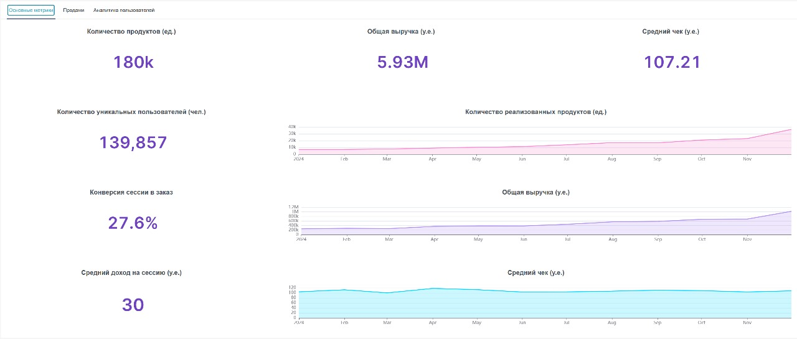
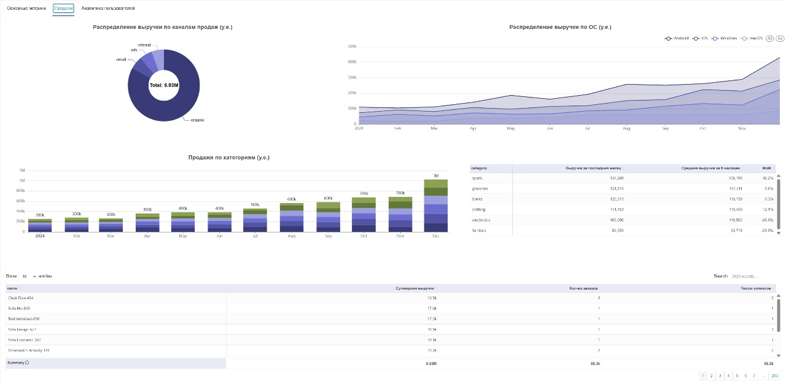
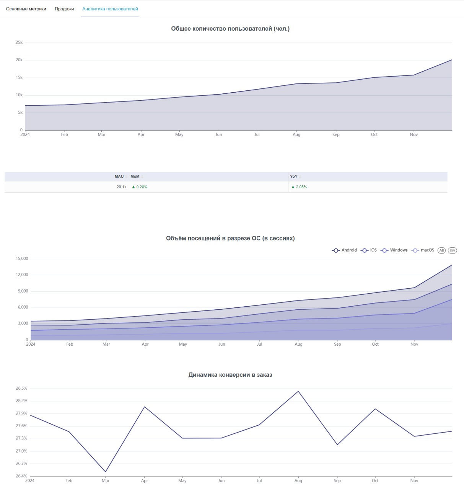
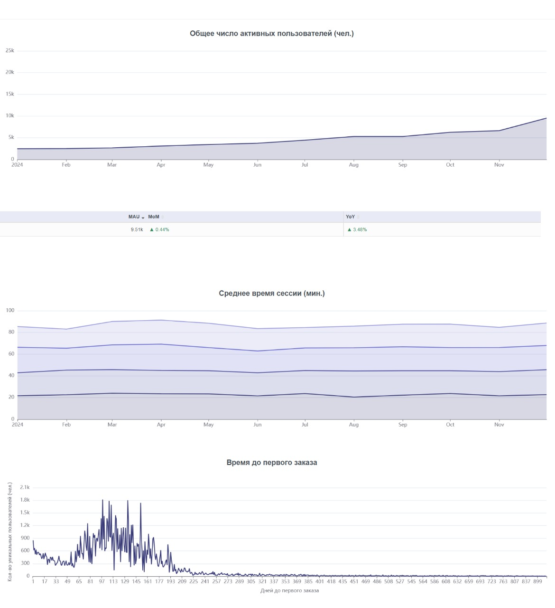

# E-commerce — продуктовая и пользовательская аналитика

##  Бизнес-цель
Дашборд помогает **находить и монетизировать точки роста**:
- **Канал / OS → конверсия**
- **Категория / SKU → вклад в GMV**
- **Трафик → первый заказ (TTF)**

*GMV — оборот; TTF — time to first order (время до первого заказа).* 

---

##  Обзор (KPI)
Что смотрим: GMV, AOV (средний чек), пользователи, конверсия → заказ, доход на сессию, реализованные продукты

**Сигналы и действия**
- Пики/просадки GMV → выясняем, какой **канал/OS/категория** двинула кривую
- AOV ↓ при стабильных заказах → усиливаем апселл/бандлы
- Конверсия ↓ при росте трафика → проверяем скорость/чекаут/платежи

---

##  Продажи (каналы, ОС, категории, SKU)

- **Каналы:** доли + динамика → куда перетекать бюджет (ROMI/CAC)
- **OS:** где конверсия/выручка тормозит (iOS/Android/desktop)
- **Категории:** MoM/сезонность → расширять лидеров, чинить просадки
- **Топ-товары:** формируем витрины, кросс-селл, бандлы

**Действия**
- Перенести бюджет из каналов с **высоким CAC и низким CR** в более эффективные (email, referral, organic); убыточные кампании — остановить/пересобрать.
- При просадке на конкретной **OS/устройстве**: аудит релиза (SDK/перфоманс/краши), быстрый фикс и **поэтапный rollout**; параллельно A/B чекаута.
- Категории с отрицательным MoM при высокой базе — промо/контент/наличие.

---

##  Пользователи и конверсия
MAU/рост, сессии по ОС, линия конверсии

**Сигналы и действия**
- MAU ↑, конверсия ↔/↓ → UX/перфоманс/чекаут
- Сессии растут только на одной OS → проверяем качество трафика/креативы
- Конверсия скачет после релизов → проверяем регрессии, фиксируем и выкатываем поэтапно

---

##  Вовлечённость и TTF
Активные пользователи, среднее время сессии, распределение **времени до 1-го заказа**

**Сигналы и действия**
- TTF длинный хвост → welcome-серии, персональные офферы
- Время сессии ↓ на конкретной OS → проблемы UX/скорости/трекинга
- Активные пользователи растут без влияния на GMV → усиливаем конверсию и AOV

---

##  Детали
- Инструмент: SuperSet, фильтры: период, канал, категория, OS/устройство
- Метрики: `Conversion = orders / users`, `AOV = revenue / orders`, MAU/YoY из витрины событий

