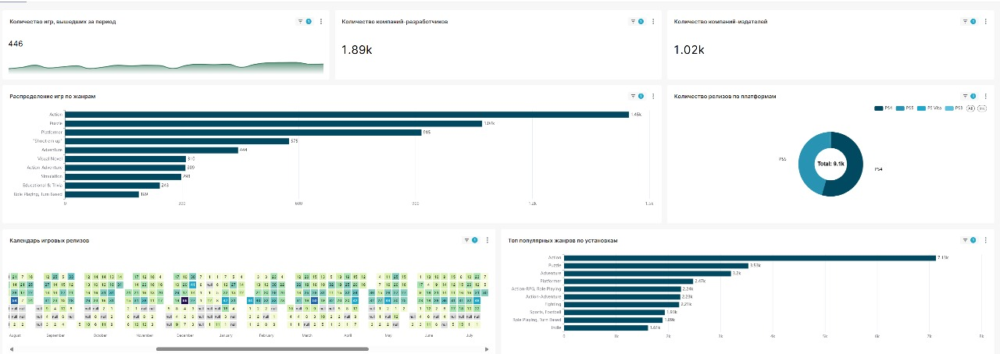
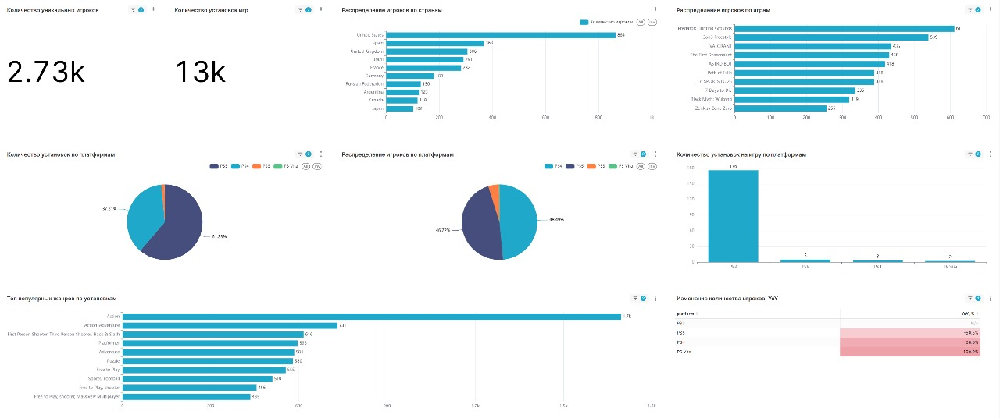
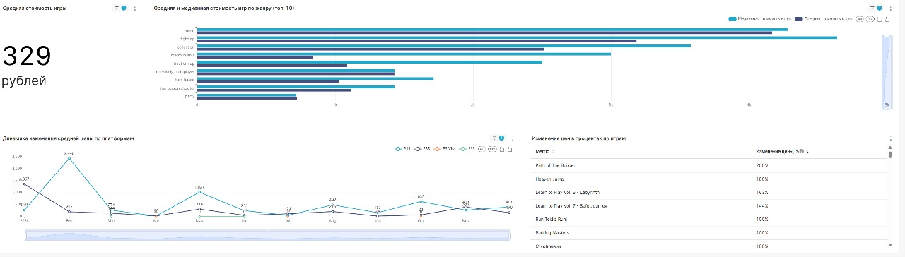

# Gamedev — аналитика рынка, игроков и цен (PlayStation eco)

## Бизнес-цель
Дашборд помогает **находить и монетизировать точки роста портфеля**:
- **Платформа / жанр → вероятность успеха релиза**
- **Окно релиза → конкуренция и сезонность**
- **Страны / платформы → где концентрировать маркетинг и локализацию**
- **Цены / промо → оптимальный прайс и окно скидок**

---

## Обзор рынка (релизы, жанры, платформы, календарь)
Что на экране:
- Кол-во релизов, # разработчиков и издателей  
- Доли релизов по платформам (PS4/PS5/PS3/PS Vita)  
- Распределение по жанрам  
- Календарь релизов (heatmap)  
- Топ-жанры по установкам

**Сигналы и действия**
- Пик релизов рядом с нашей датой → перенос окна на -2/+3 недели  
- Жанры в росте по установкам → приоритезируем питч/продакшн, готовим фичер-ассеты 
- Платформа-драйвер (напр., PS5) → усиливаем билд/перфоманс, договариваемся о слотах/бандлах

---

## Игроки: объём, платформы, география, топ-игры
- Уникальные игроки и установки  
- Установки по платформам  
- Игроки по странам + доли по платформам  
- Топ-игры по количеству игроков  
- Изменение количества игроков YoY по платформам

**Сигналы и действия**
- Страны-локомотивы (US/UK/BR/FR …) → локализация, ценовые тесты, региональные промо
- Платформа с большей базой (PS4 vs PS5) → конфиг маркетинга/ассортимента под фактическую аудиторию 
- Топ-франшизы → кросс-промо, DLC, бандлы
- YoY по платформам проседает → витрина/фичеринг/цена/слоты у платформодержателя

---

## Цены и промо: средняя цена, по жанрам, динамика, изменения
- Средняя цена  
- Средняя/медианная цена по жанрам (топ-10)  
- Динамика средней цены по платформам  
- Таблица изменений цен по играм

**Сигналы и действия**
- Жанры с высокой медианой → выше стартовый прайс; жанры с низкой медианой → прайс-поинт + бандлы
- Падение средней цены на платформе → готовим скидку/сезонное промо под окно максимального эффекта 
- История изменений цен по тайтлам рынка → планируем свой прайс-календарь, избегаем «сгорания» скидок

