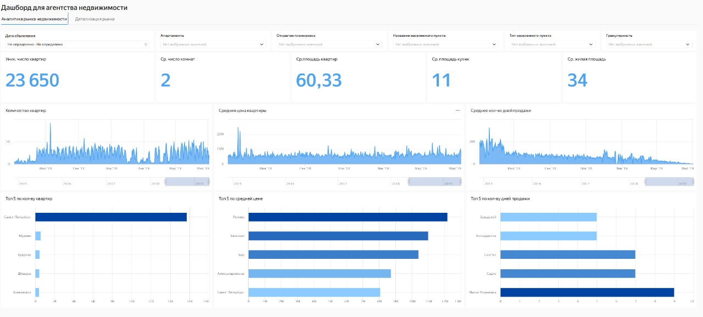
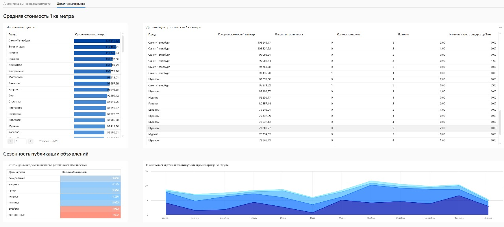

# Real Estate — аналитика рынка

## Бизнес-цель
Быстро понимать, где и по какой цене объекты продаются быстрее/медленнее, и как перераспределять бюджет и усилия агентов

**Для кого:** руководитель продаж/маркетинга, тимлиды агентов

## Основные блоки
- KPI: уникальные квартиры, среднее число комнат, средние площади (кв., кухня, жилая)
- Динамика: количество квартир, средняя цена, среднее количество дней продажи
- Гео: топ-5 по числу лотов, по средней цене, по времени продажи
- Фильтры: дата, апартаменты, открытая планировка, населённый пункт/тип, гранулярность

## 📸 Скриншоты

## Пример использования
> «В июле–сентябре время продажи в районе *Садко* выросло. Корректируем прайс-коридор и усиливаем промо  
> Наоборот, в *Репино* — платёжеспособный спрос; здесь допускаем аплифт цены и поднимаем выдачу»

## 🔎 Детализация рынка

- **Средняя стоимость 1 м² по городам** — где квадрат дороже/дешевле рынка.  
- **Таблица детализации** (1 м² × атрибуты): открытая планировка, #комнат, балконы, наличие парка → видим, какие параметры дают премию/скидку.  
- **Сезонность публикаций**:
  - по **дням недели** — когда агенты чаще выкладывают объявления;
  - по **месяцам/годам** — пики годового цикла.

**Инсайт:** дорогие локации с «открытой планировкой» и 2–3 комнатами получают премию к 1 м²; в них можно держать ценник выше медианы. Публиковаться лучше в **пн–ср**, на **вс** — минимум активности.

## ▶️ Видео
[Смотреть демо на Google Drive](https://drive.google.com/file/d/1Hq1m5rajWHAiMbjQrTPSJZtHsGhR3Yy/view?usp=sharing)

