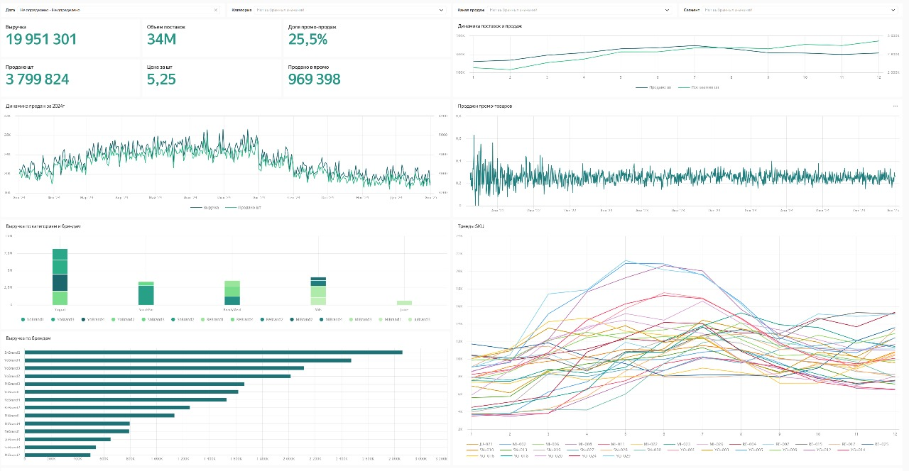
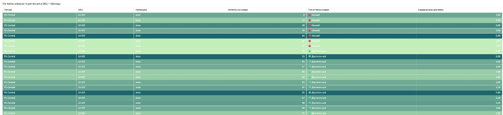

# FMCG — продажи и запасы

## Бизнес-цель
Управлять выручкой и наличием товара: синхронизировать **продажи ↔ поставки**, снижать **OOS** (нет наличия) и **overstock**, держать SLA по **lead time**.

**Для кого:** коммерческий директор, категория/бренд-менеджеры, логистика, финансы 
**Фильтры:** период, категория, бренд, канал продаж, сегмент/регион

---

## KPI-обзор 

- Выручка, объём поставок, продано шт, цена/шт, доля промо
- Динамика продаж (всплески/просадки)
- Поставки vs продажи по месяцам — баланс спроса и пополнений
- Продажи в промо (история) — стабильность эффектов промо-механик
- Вклад категорий/брендов
- Тренды ключевых SKU -  — растущие/падающие позиции

**Как читать**
- Продажи растут, а поставки плоские → риск OOS через 1–2 недели
- Цена/шт ↓, а GMV ↑ → ценовой коридор «попал», закрепляем
- Промо даёт продажи без роста GMV → каннибализация/пересборка механики
- В трендах SKU появились явные спады/росты → проверяем наличие/цену/полку

**Рекомендации к действию**
- Перед акциями — поднять план поставок по растущим SKU, выровнять график отгрузок
- Урезать неэффективные промо-механики, оставить механики с LTV-эффектом
- Перераспределить полку/медиа под бренды с лучшим вкладом в GMV
- Для падающих SKU — «поддержка» (ценник/дисплей/кросс-селл) или вывод

---

## Контроль остатков и lead time

**Что видно**
- Остаток по SKU × регион/склад, тип остатка (низкий/достаточный), строки выделены цветом по просьбе заказчика - чем темнее строка, тем дольше средний срок доставки на склад, в совокупности с цветовым индикатором остатка (сортировка по нему же) позволяет корректировать закупки (не ставить на стоп товары и не перегружать склады)

**Сигналы → действия**
- «Низкий» остаток + длинный lead time → экстренное пополнение / переброс между складами / временный uplift заказа
- «Достаточный», но спрос падает → заморозка заказа, перераспределение в соседние регионы
- SLA не выдержан → переговор с поставщиком / альтернативный маршрут

